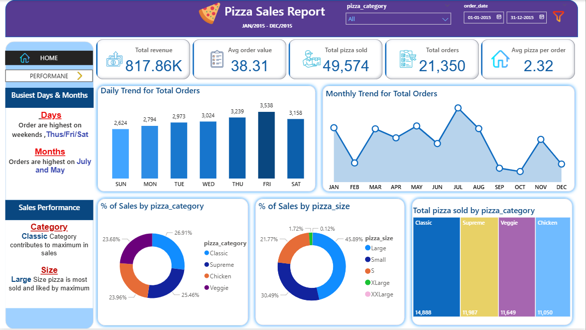

# 🍕 Pizza Sales Report Dashboard

### 🕒 Data Period: **January 2015 – December 2015**

---

## 🖼️ Dashboard Preview

### **Preview 1 – Overview Dashboard**

### **Preview 2 – Performance Dashboard**
)

---

## 📊 Overview

The **Pizza Sales Report Dashboard** provides a comprehensive analysis of pizza sales performance throughout the year 2015. It gives insights into revenue, order trends, product performance, and customer preferences across various pizza categories and sizes.

---

## 📈 Key Metrics

| Metric | Value | Description |
|--------|--------|-------------|
| **Total Revenue** | **$817.86K** | Overall revenue generated from pizza sales |
| **Average Order Value** | **$38.31** | Average revenue per order |
| **Total Pizzas Sold** | **49,574** | Total number of pizzas sold |
| **Total Orders** | **21,350** | Number of individual orders placed |
| **Average Pizza per Order** | **2.32** | Average number of pizzas ordered per transaction |

---

## 🕒 Order Trends

### **Daily Trend**
- **Highest Orders:** Thursday, Friday, Saturday  
- **Lowest Orders:** Sunday  
- Orders peak towards the **weekends**.

### **Monthly Trend**
- **Highest Sales Months:** **July** and **May**  
- Sales show fluctuating demand with peaks in mid-year.

---

## 🍕 Sales Performance

### **By Category**
| Category | % of Total Sales | Total Pizzas Sold |
|-----------|------------------|-------------------|
| **Classic** | 26.91% | 14,888 |
| **Supreme** | 25.46% | 11,987 |
| **Veggie** | 23.68% | 11,649 |
| **Chicken** | 23.96% | 11,050 |

📌 **Classic Category** contributes the maximum sales.

---

### **By Size**
| Size | % of Total Sales | Insights |
|------|------------------|-----------|
| **Large** | 45.89% | Most popular and preferred by customers |
| **Medium** | 30.49% | Second most popular size |
| **Small** | 21.77% | Moderate demand |
| **XLarge** | 1.72% | Very low demand |
| **XXLarge** | 0.12% | Negligible sales |

📌 **Large Pizzas** dominate the market share.

---

## 🏆 Best & Worst Sellers

### **Top 5 Pizzas by Revenue**
1. The Thai Chicken Pizza – **$43,434.25**  
2. The Barbecue Chicken Pizza – **$42,768.00**  
3. The California Chicken Pizza – **$41,409.50**  
4. The Classic Deluxe Pizza – **$38,180.50**  
5. The Spicy Italian Pizza – **$34,831.25**

### **Top 5 Pizzas by Quantity**
1. The Classic Deluxe Pizza – **2,453 units**  
2. The Barbecue Chicken Pizza – **2,432 units**  
3. The Hawaiian Pizza – **2,422 units**  
4. The Pepperoni Pizza – **2,418 units**  
5. The Thai Chicken Pizza – **2,371 units**

---

### **Bottom 5 Pizzas by Revenue**
1. The Brie Carre Pizza – **$11,588.50**  
2. The Green Garden Pizza – **$13,955.75**  
3. The Spinach Pizza – **$15,596.00**  
4. The Mediterranean Pizza – **$15,360.50**  
5. The Spinach Supreme Pizza – **$15,277.75**

### **Bottom 5 Pizzas by Quantity**
1. The Brie Carre Pizza – **490 units**  
2. The Mediterranean Pizza – **934 units**  
3. The Calabrese Pizza – **937 units**  
4. The Spinach Pizza – **950 units**  
5. The Soprano Pizza – **961 units**

📉 **The Brie Carre Pizza** performs the worst in both **revenue** and **quantity**.

---

## 🔍 Key Insights
- **Peak Days:** Thursday to Saturday  
- **Peak Months:** May and July  
- **Best Selling Category:** Classic  
- **Most Preferred Size:** Large  
- **Top Revenue Contributor:** Thai Chicken Pizza  
- **Lowest Performer:** Brie Carre Pizza  

---

## 🧩 Tools & Visualization
- **Dashboard Created Using:** Power BI (or similar BI tool)  
- **Visuals Used:**  
  - Bar charts (for trends and performance)  
  - Line chart (for monthly trends)  
  - Donut charts (for category & size distribution)  
  - KPI cards (for key metrics)

---

## 📁 Usage
This dashboard is ideal for:
- Analyzing pizza sales patterns  
- Understanding product performance  
- Identifying top/low performing SKUs  
- Supporting data-driven marketing & inventory decisions

---

## 🧠 Summary
The dashboard effectively highlights sales insights for a pizza business over a year, helping stakeholders optimize inventory, pricing, and marketing strategies based on **data-backed decisions**.
